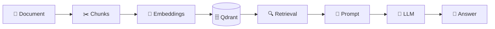

# Local RAG Application in C# with Ollama and Qdrant

A simple educational project that demonstrates how to build a fully local Retrieval-Augmented Generation (RAG) application using **C#**, **Ollama**, and **Qdrant**.

The application reads a local document, splits it into chunks, generates embeddings, stores them in Qdrant, retrieves the most relevant context for a question, and sends that context to a local LLM running through Ollama.

> **Disclaimer:** This project is purely for educational purposes. There are better ways to structure, secure, and optimize real-world applications. Use it as a starting point for learning and adapt it to your production requirements.

## Related Articles

This repository accompanies my two-part article series:

- [Build a Local RAG Application in C# with Ollama and Qdrant - Part 1](https://www.ottorinobruni.com/build-local-rag-application-csharp-ollama-qdrant-part-1/)
- [Build a Local RAG Application in C# with Ollama and Qdrant - Part 2](https://www.ottorinobruni.com/build-local-rag-application-csharp-ollama-qdrant-part-2/)

You may also find this introductory article useful:

- [AI Basics for Developers: Tokens, Inference, Embeddings, Vector Databases and RAG Explained](https://www.ottorinobruni.com/ai-basics-for-developers-tokens-inference-embeddings-vector-databases-rag-explained/)

## How It Works

The complete flow is:



### How it works

1. **Document** — The source document is loaded.
2. **Chunks** — The document is split into smaller pieces of text.
3. **Embeddings** — Each chunk is converted into a numerical vector using an embedding model.
4. **Qdrant** — The vectors and their associated text are stored in the Qdrant vector database.
5. **Retrieval** — When the user asks a question, the most relevant chunks are retrieved using vector similarity.
6. **Prompt** — The retrieved context is combined with the user's question.
7. **LLM** — The final prompt is sent to the local language model.
8. **Answer** — The model generates an answer based on the retrieved context.


The project uses:

- **C# / .NET** to coordinate the RAG pipeline.
- **Ollama** to run the local AI models.
- **nomic-embed-text** to generate embeddings.
- **llama3.2** to generate the final answer.
- **Qdrant** to store embeddings and perform vector similarity search.

Everything can run locally on your machine.

## Prerequisites

Before running the project, install:

- [.NET SDK](https://dotnet.microsoft.com/download)
- [Ollama](https://ollama.com/)
- [Docker](https://www.docker.com/)
- [Qdrant](https://qdrant.tech/)
- [Visual Studio Code](https://code.visualstudio.com/) or another C# IDE
- [C# Dev Kit for VS Code](https://marketplace.visualstudio.com/items?itemName=ms-dotnettools.csdevkit) if you use VS Code

## 1. Install the Ollama Models

Pull the local language model:

```bash
ollama pull llama3.2
```

Pull the embedding model:

```bash
ollama pull nomic-embed-text
```

Verify that the models are available:

```bash
ollama list
```

Ollama normally exposes its local API at:

```text
http://localhost:11434
```

## 2. Run Qdrant

Download the latest Qdrant Docker image:

```bash
docker pull qdrant/qdrant
```

Run Qdrant:

```bash
docker run -p 6333:6333 -p 6334:6334 \
    -v "$(pwd)/qdrant_storage:/qdrant/storage:z" \
    qdrant/qdrant
```

The ports used are:

- `6333` — Qdrant HTTP/REST API and web interface.
- `6334` — Qdrant gRPC API used by the .NET client.

You can verify that Qdrant is running with:

```bash
docker ps
```

Or open:

```text
http://localhost:6333
```

The `qdrant_storage` directory keeps the vector database data persistent when the container is stopped or recreated.

## 3. Clone and Restore the Project

Clone the repository:

```bash
git clone https://github.com/ottorinobruni/LocalRagDemo
cd LocalRagDemo
```

Restore the dependencies:

```bash
dotnet restore
```

The project uses the official Qdrant .NET client:

```bash
dotnet add package Qdrant.Client
```

Ollama is accessed directly through its local HTTP API using `HttpClient`.

## Project Structure

A minimal version of the project looks like this:

```text
LocalRagDemo
├── Documents
│   └── sample.txt
├── Models
│   ├── OllamaEmbeddingResponse.cs
│   ├── OllamaGenerateResponse.cs
│   ├── SearchResult.cs
│   └── DocumentChunk.cs
├── OllamaService.cs
├── QdrantVectorStore.cs
├── Program.cs
└── LocalRagDemo.csproj
```

## 4. Add a Document

Add a text file to:

```text
Documents/sample.txt
```

You can replace the sample content with any text you want to query.

The project currently focuses on plain text files to keep the example centered on the RAG pipeline. PDF, Word, OCR, and more advanced document parsing are intentionally outside the scope of this demo.

The project file should copy the `Documents` directory to the output folder:

```xml
<ItemGroup>
  <Content Include="Documents/**/*">
    <CopyToOutputDirectory>PreserveNewest</CopyToOutputDirectory>
  </Content>
</ItemGroup>
```

The application can then resolve the document path using `AppContext.BaseDirectory`.

## 5. Run the Application

Make sure Ollama and Qdrant are already running, then execute:

```bash
dotnet run
```

The application will:

1. Read the local document.
2. Split it into smaller chunks.
3. Generate an embedding for each chunk using `nomic-embed-text`.
4. Store the vectors and document text in Qdrant.
5. Wait for a user question.
6. Generate an embedding for the question.
7. Retrieve the most relevant chunks from Qdrant.
8. Build a prompt containing the retrieved context.
9. Ask `llama3.2` to answer using that context.

You should see output similar to:

```text
Indexed 1 document chunks.

Ask a question about the document.
Type 'exit' to quit.

You:
```

## Example Questions

Try questions such as:

```text
How does authentication work?
```

```text
How is the application deployed?
```

And also test a question whose answer does not exist in the document:

```text
Which database does the application use?
```

The prompt instructs the local LLM to use only the retrieved context and avoid inventing information that is not present in the documents.

## Configuration

The default configuration used by the sample application is:

```csharp
const string ollamaUrl = "http://localhost:11434";
const string qdrantHost = "localhost";
const int qdrantPort = 6334;

const string embeddingModel = "nomic-embed-text";
const string chatModel = "llama3.2";
const string collectionName = "local-rag";
```

If your services run on different ports or hosts, update these values accordingly.

## Resources

- [Ollama](https://ollama.com/)
- [Ollama API Documentation](https://docs.ollama.com/api/introduction)
- [Qdrant](https://qdrant.tech/)
- [Qdrant Documentation](https://qdrant.tech/documentation/)
- [.NET](https://dotnet.microsoft.com/)

## Author

Created by **Ottorino Bruni**.

- Blog: [ottorinobruni.com](https://www.ottorinobruni.com/)
- Linkedin: [www.linkedin.com/in/ottorinobruni](https://www.linkedin.com/in/ottorinobruni/)
- X / Twitter: [@ottorinobruni](https://twitter.com/ottorinobruni)

If you found the project useful, you can follow the complete explanation in the related article series linked above.
