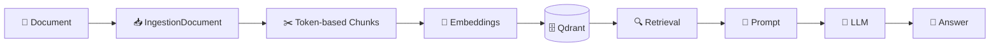

# Local RAG Application in C# with Ollama and Qdrant

A simple educational project that demonstrates how to build a fully local Retrieval-Augmented Generation (RAG) application using **C#**, **Ollama**, and **Qdrant**.

The application reads a local document through `Microsoft.Extensions.DataIngestion`, splits it into token-based chunks, generates embeddings, stores them in Qdrant, retrieves the most relevant context for a question, and sends that context to a local LLM running through Ollama.

> **Disclaimer:** This project is purely for educational purposes. There are better ways to structure, secure, and optimize real-world applications. Use it as a starting point for learning and adapt it to your production requirements.

## Related Articles

This repository accompanies my article series:

- [Build a Local RAG Application in C# with Ollama and Qdrant - Part 1](https://www.ottorinobruni.com/build-local-rag-application-csharp-ollama-qdrant-part-1/)
- [Build a Local RAG Application in C# with Ollama and Qdrant - Part 2](https://www.ottorinobruni.com/build-local-rag-application-csharp-ollama-qdrant-part-2/)
- [Build a Local RAG Application in C# with Ollama and Qdrant - Part 3](https://www.ottorinobruni.com/build-local-rag-application-csharp-ollama-qdrant-part-3/)
- [Build a Local RAG Application in C# with Ollama and Qdrant - Part 4](https://www.ottorinobruni.com/build-local-rag-application-csharp-ollama-qdrant-part-4/)

You may also find this introductory article useful:

- [AI Basics for Developers: Tokens, Inference, Embeddings, Vector Databases and RAG Explained](https://www.ottorinobruni.com/ai-basics-for-developers-tokens-inference-embeddings-vector-databases-rag-explained/)

## How It Works

The complete flow is:



### How it works

1. **Document** — The source document is loaded through the ingestion layer.
2. **IngestionDocument** — The reader converts the source into a normalized document representation.
3. **Chunks** — `DocumentTokenChunker` splits the document into token-based chunks with overlap.
4. **Embeddings** — Each chunk is converted into a numerical vector using an embedding model.
5. **Qdrant** — The vectors and their associated text are stored in the Qdrant vector database.
6. **Retrieval** — When the user asks a question, the most relevant chunks are retrieved using vector similarity.
7. **Prompt** — The retrieved context is combined with the user's question.
8. **LLM** — The final prompt is sent to the local language model.
9. **Answer** — The model generates an answer based on the retrieved context.

The project uses:

- **C# / .NET 10** to implement the RAG pipeline.
- **Microsoft.Extensions.AI** to provide abstractions for chat and embedding generation.
- **Microsoft.Extensions.VectorData** to provide abstractions for vector storage and vector search.
- **Microsoft.Extensions.DataIngestion** to read and prepare documents for chunking.
- **Microsoft.Extensions.DataIngestion.Markdig** to read the sample text document into an `IngestionDocument`.
- **Microsoft.ML.Tokenizers** to support token-based chunking.
- **OllamaSharp** to integrate Ollama with `Microsoft.Extensions.AI`.
- **CommunityToolkit.VectorData.Qdrant** to integrate Qdrant with `Microsoft.Extensions.VectorData`.
- **Ollama** to run the local AI models.
- **nomic-embed-text** to generate embeddings.
- **llama3.2** to generate the final answer.
- **Qdrant** to store embeddings and perform vector similarity search.

Everything can run locally on your machine.

## What's New in Part 4

Part 4 improves the document ingestion stage while keeping the AI, vector-store, retrieval, and generation pipeline from Part 3 unchanged.

The main changes are:

- Added `Microsoft.Extensions.DataIngestion`.
- Added `Microsoft.Extensions.DataIngestion.Markdig`.
- Replaced `File.ReadAllTextAsync` with a document reader that produces an `IngestionDocument`.
- Replaced the custom `SplitDocument` method with `DocumentTokenChunker`.
- Replaced character-based chunking with token-based chunking.
- Added configurable token overlap between consecutive chunks.
- Added `Microsoft.ML.Tokenizers.Data.O200kBase` for the local tokenizer data used by `TiktokenTokenizer`.
- Kept the existing `DocumentChunk` model and mapped ingestion chunks into it.
- Kept `Microsoft.Extensions.AI`, `Microsoft.Extensions.VectorData`, Ollama, and Qdrant unchanged.

The overall RAG flow is still familiar, but document preparation is now handled by a dedicated ingestion layer:

```text
Document → IngestionDocument → Token-based Chunks → Embeddings → Vector Store → Retrieval → Prompt → LLM → Answer
```

## Prerequisites

Before running the project, install:

- [.NET SDK](https://dotnet.microsoft.com/download)
- [Ollama](https://ollama.com/)
- [Docker](https://www.docker.com/)
- [Qdrant](https://qdrant.tech/)
- [Visual Studio Code](https://code.visualstudio.com/) or another C# IDE
- [C# Dev Kit for VS Code](https://marketplace.visualstudio.com/items?itemName=ms-dotnettools.csdevkit) if you use VS Code

## 1. Install the Ollama Models

Pull the local language model:

```bash
ollama pull llama3.2
```

Pull the embedding model:

```bash
ollama pull nomic-embed-text
```

Verify that the models are available:

```bash
ollama list
```

Ollama normally exposes its local API at:

```text
http://localhost:11434
```

## 2. Run Qdrant

Download the latest Qdrant Docker image:

```bash
docker pull qdrant/qdrant
```

Run Qdrant:

```bash
docker run -p 6333:6333 -p 6334:6334 \
    -v "$(pwd)/qdrant_storage:/qdrant/storage:z" \
    qdrant/qdrant
```

The ports used are:

- `6333` — Qdrant HTTP/REST API and web interface.
- `6334` — Qdrant gRPC API used by the .NET client.

You can verify that Qdrant is running with:

```bash
docker ps
```

Or open:

```text
http://localhost:6333
```

The `qdrant_storage` directory keeps the vector database data persistent when the container is stopped or recreated.

## 3. Clone and Restore the Project

Clone the repository:

```bash
git clone https://github.com/ottorinobruni/LocalRagDemo
cd LocalRagDemo
```

Restore the dependencies:

```bash
dotnet restore
```

The project uses the following main NuGet packages:

```bash
dotnet add package Microsoft.Extensions.AI
dotnet add package Microsoft.Extensions.DataIngestion --version 10.10.0-preview.1.26459.2
dotnet add package Microsoft.Extensions.DataIngestion.Markdig --version 10.10.0-preview.1.26459.2
dotnet add package Microsoft.ML.Tokenizers.Data.O200kBase --version 2.0.0
dotnet add package OllamaSharp
dotnet add package CommunityToolkit.VectorData.Qdrant
dotnet add package Qdrant.Client
```

`Microsoft.Extensions.AI` provides common abstractions for chat and embedding generation.

`Microsoft.Extensions.DataIngestion` provides abstractions for document reading and chunking.

`Microsoft.Extensions.DataIngestion.Markdig` provides the reader used to convert `sample.txt` into an `IngestionDocument`.

`Microsoft.ML.Tokenizers.Data.O200kBase` provides the tokenizer data required by `TiktokenTokenizer.CreateForModel("gpt-4o")`. The tokenizer is used locally only to count tokens and determine chunk boundaries; the application still uses `nomic-embed-text` for embeddings and `llama3.2` for generation.

Ollama is integrated through `OllamaSharp`, while Qdrant is integrated through `CommunityToolkit.VectorData.Qdrant`.

## Project Structure

The current version of the project keeps a small structure while using `Microsoft.Extensions.DataIngestion`, `Microsoft.Extensions.AI`, and `Microsoft.Extensions.VectorData` for the main RAG building blocks.

```text
LocalRagDemo
├── Documents
│   └── sample.txt
├── Models
│   └── DocumentChunk.cs
├── Program.cs
└── LocalRagDemo.csproj
```

The custom Ollama response models, `OllamaService`, `SearchResult`, and the custom `QdrantVectorStore` used in Part 2 are no longer needed.

## 4. Add a Document

Add a text file to:

```text
Documents/sample.txt
```

You can replace the sample content with any text you want to query.

The project currently focuses on a simple `sample.txt` file. It is read through the Markdown reader from `Microsoft.Extensions.DataIngestion.Markdig`, which gives the application an `IngestionDocument` without requiring a custom reader. PDF, Word, OCR, and more advanced document parsing are intentionally outside the scope of this demo.

The project file should copy the `Documents` directory to the output folder:

```xml
<ItemGroup>
  <Content Include="Documents/**/*">
    <CopyToOutputDirectory>PreserveNewest</CopyToOutputDirectory>
  </Content>
</ItemGroup>
```

The application can then resolve the document path using `AppContext.BaseDirectory`.

## 5. Run the Application

Make sure Ollama and Qdrant are already running, then execute:

```bash
dotnet run
```

The application will:

1. Read the local document into an `IngestionDocument`.
2. Split it into token-based chunks with `DocumentTokenChunker`.
3. Map the ingestion chunks into the existing `DocumentChunk` model.
4. Generate embeddings for each chunk using `nomic-embed-text` through `IEmbeddingGenerator`.
5. Store the chunks and vectors in Qdrant through `Microsoft.Extensions.VectorData`.
6. Wait for a user question.
7. Generate an embedding for the question.
8. Retrieve the most relevant chunks using VectorData.
9. Build a prompt containing the retrieved context.
10. Ask `llama3.2` through `IChatClient` to answer using that context.

You should see output similar to:

```text
Indexed 1 document chunks.

Ask a question about the document.
Type 'exit' to quit.

You:
```

## Example Questions

Try questions such as:

```text
How does authentication work?
```

```text
How is the application deployed?
```

And also test a question whose answer does not exist in the document:

```text
Which database does the application use?
```

The prompt instructs the local LLM to answer using only the retrieved context and avoid inventing information that is not present in the document.

The application also uses a minimum similarity score to avoid passing weakly related chunks to the language model.

## Configuration

The default configuration used by the sample application is:

```csharp
const string OllamaUrl = "http://localhost:11434";
const string ChatModel = "llama3.2";
const string EmbeddingModel = "nomic-embed-text";

const string QdrantHost = "localhost";
const int QdrantPort = 6334;
const string CollectionName = "local-rag";

const int MaxTokensPerChunk = 200;
const int OverlapTokens = 30;
const int TopResults = 3;
const double MinimumScore = 0.5;
```

If your services run on different ports or hosts, update these values accordingly.

## Article Versions

Each article corresponds to a tagged version of the repository:

- `part-1` — Initial project setup.
- `part-2` — Manual RAG implementation with Ollama and Qdrant.
- `part-3` — RAG implementation using `Microsoft.Extensions.AI` and `Microsoft.Extensions.VectorData`.
- `part-4` — Document ingestion using `Microsoft.Extensions.DataIngestion` and token-based chunking.

You can check out a specific version using:

```bash
git checkout part-4
```

## Resources

- [Microsoft.Extensions.AI](https://learn.microsoft.com/dotnet/ai/microsoft-extensions-ai)
- [Microsoft.Extensions.VectorData](https://learn.microsoft.com/dotnet/ai/vector-data)
- [Microsoft.Extensions.DataIngestion](https://learn.microsoft.com/dotnet/ai/conceptual/data-ingestion)
- [Ollama](https://ollama.com/)
- [Ollama API Documentation](https://docs.ollama.com/api/introduction)
- [Qdrant](https://qdrant.tech/)
- [Qdrant Documentation](https://qdrant.tech/documentation/)
- [.NET](https://dotnet.microsoft.com/)

## Author

Created by **Ottorino Bruni**.

- Blog: [ottorinobruni.com](https://www.ottorinobruni.com/)
- LinkedIn: [www.linkedin.com/in/ottorinobruni](https://www.linkedin.com/in/ottorinobruni/)
- X / Twitter: [@ottorinobruni](https://twitter.com/ottorinobruni)

If you found the project useful, you can follow the complete explanation in the related article series linked above.
